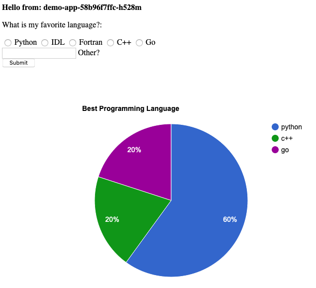
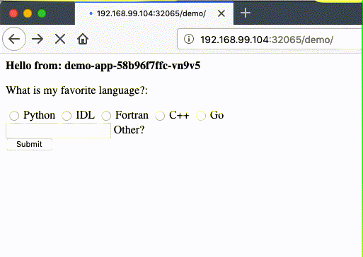

Build a web app with Kubernetes
===============================

This tutorial shows how to build a Docker image to serve a web app and how to deploy that service using [Kubernetes](https://kubernetes.io/) (k8s). Unless otherwise stated, the commands are assumed to run from the working directory containing this `README.md` file.

Verify operation manually with Docker
-------------------------------------

Deploy a container for the MySQL database service:
```
docker run -d --rm --name demo-app-db \
  -p 3306:3306 \
  -e MYSQL_ROOT_PASSWORD=password \
  mysql:5.6
```
Build the demo app Docker image:
```
docker build -t k8s-demo-app .
```
Deploy a container for the web app frontend:
```
docker run -d --rm --name demo-app \
  --link demo-app-db:mysql \
  -p 8080:8080 \
  -e HTTP_PORT=8080 \
  -e MYSQL_USER=root \
  -e MYSQL_PASS=password \
  -e MYSQL_SERVER=mysql \
  -e MYSQL_PORT=3306 \
  k8s-demo-app
```
View the running containes using `docker ps`:
```
$ docker ps

CONTAINER ID        IMAGE               COMMAND                  CREATED             STATUS              PORTS                    NAMES
5d26164017cc        k8s-demo-app        "python main.py"         6 seconds ago       Up 5 seconds        0.0.0.0:8080->8080/tcp   demo-app
e9b65488d224        mysql:5.6           "docker-entrypoint.s…"   2 minutes ago       Up 2 minutes        0.0.0.0:3306->3306/tcp   demo-app-db
```
Open [0.0.0.0:8080](0.0.0.0:8080) in your browser to view the web app in action. If you verified that it works, proceed to deployment via Kubernetes.

Deployment using Kubernetes via Minikube
----------------------

Launch a local single-node cluster using [minikube](https://kubernetes.io/docs/tutorials/hello-minikube/):
```
minikube start
```
(_optional_) Open the dashboard for real-time status and control of the cluster:
```
minikube dashboard
```
Configure your shell session for local development:
```
eval $(minikube docker-env)
```
Minikube runs a k8s cluster in a virtual machine (VM) which will not see the `k8s-demo-app` image you built earlier on the host machine (use `docker image list` to check), so build it "again" in Minikube:
```
docker build -t k8s-demo-app .
```
Verify that the image is available to Docker locally:
```
$ docker image list

REPOSITORY    TAG     IMAGE ID      CREATED        SIZE
k8s-demo-app  latest  2aaa1d3c86a7  5 seconds ago  942MB
...
```
Apply the k8s configuration file `k8s-demo-app.yaml`:
```
kubectl apply -f k8s-demo-app.yaml
```
If everything is deployed properly, you should see green check mark icons in the dashboard web view. Alternatively, you can view status using commands:
```
$ kubectl get deployment

NAME          READY   UP-TO-DATE   AVAILABLE   AGE
demo-app      1/1     1            1           22m
demo-app-db   1/1     1            1           22m

$ kubectl get pod

NAME                           READY   STATUS    RESTARTS   AGE
demo-app-58b96f7ffc-h528m      1/1     Running   3          22m
demo-app-db-5fc7d9c565-wjmj2   1/1     Running   0          22m

$ kubectl get service

NAME          TYPE        CLUSTER-IP      EXTERNAL-IP   PORT(S)          AGE
demo-app      NodePort    10.106.45.30    <none>        8080:32065/TCP   22m
demo-app-db   NodePort    10.109.151.26   <none>        3306:32542/TCP   22m
kubernetes    ClusterIP   10.96.0.1       <none>        443/TCP          42m
```

Since your k8s cluster is running in a VM, you must use `minikube` to discover the demo app "external" URL so that you can open it in a browser:
```
$ minikube service list
|----------------------|---------------------------|-----------------------------|-----|
|      NAMESPACE       |           NAME            |         TARGET PORT         | URL |
|----------------------|---------------------------|-----------------------------|-----|
| default              | demo-app                  | http://192.168.99.104:32065 |
| default              | demo-app-db               | http://192.168.99.104:32542 |
...
```
You can launch the web page directly using
```
minikube service demo-app
```

---



---

You will notice that when you refresh the page, the same "pod" name is displayed because there is only one pod for the demo-app "deployment". (In this demo, "pod" is equivalent to "container" because each pod consists of only a single container.) Edit the deployment configuration file `k8s-demo-app.yaml` to specify a number of "replicas":
```
...
apiVersion: apps/v1
kind: Deployment
metadata:
  name: demo-app
spec:
  replicas: 3
  selector:
    matchLabels:
      app: demo-app
  template:
  ...
```
Then simply reapply the config to the cluster:
```
kubectl apply -f k8s-demo-app.yaml
```
Now you should see three identical pods deployed (exact names will vary):
```
$ kubectl get pod

NAME                           READY   STATUS    RESTARTS   AGE
demo-app-58b96f7ffc-h528m      1/1     Running   3          37m
demo-app-58b96f7ffc-n7m6q      1/1     Running   0          9s
demo-app-58b96f7ffc-vn9v5      1/1     Running   0          9s
demo-app-db-5fc7d9c565-wjmj2   1/1     Running   0          37m
```
When you refresh the web page a few times (using CTRL+SHIFT+R or equivalent cache-flushing method) you should see the pod name cycle through the three available pods.


